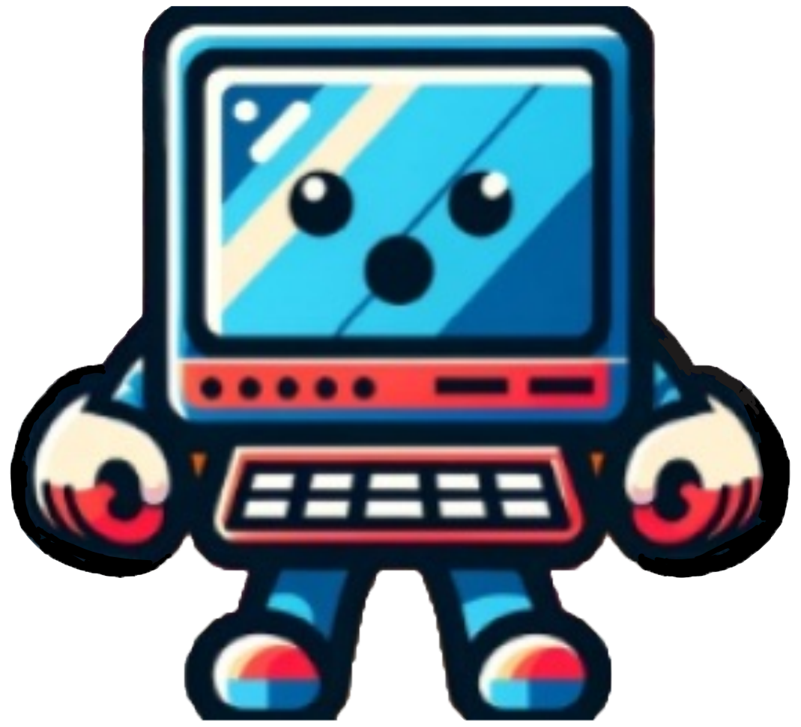
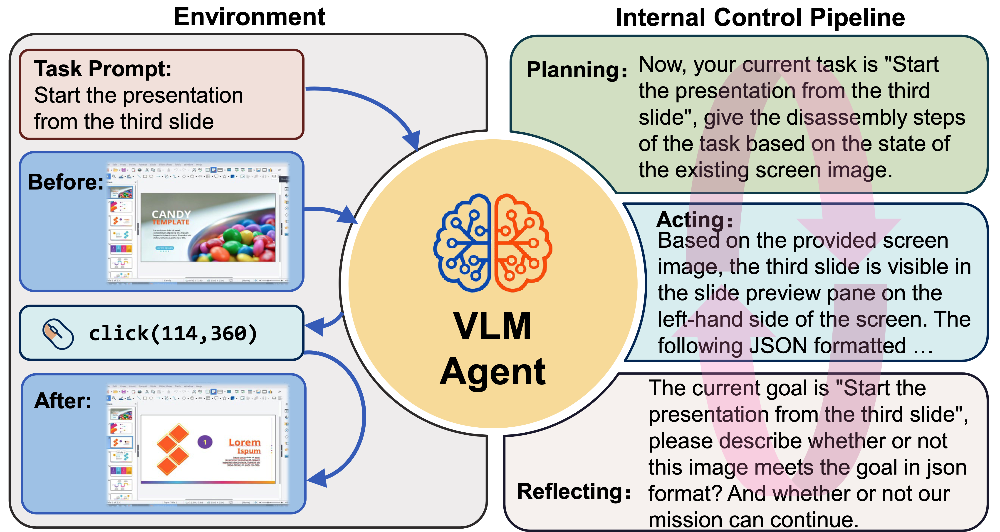
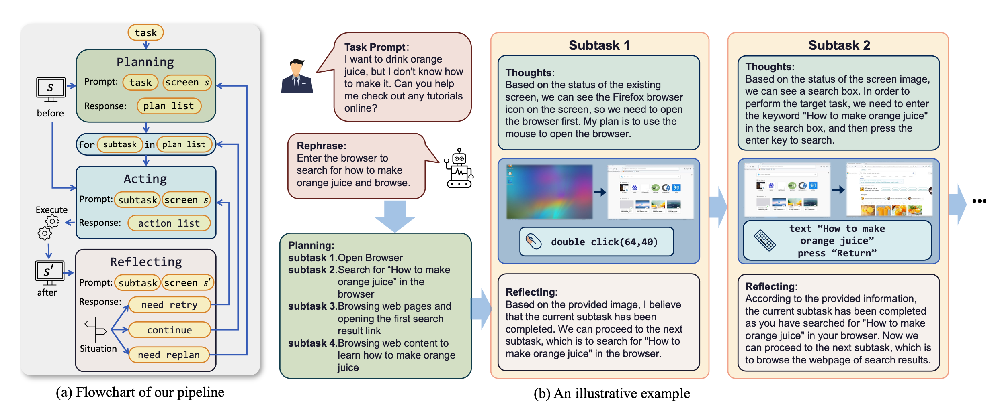
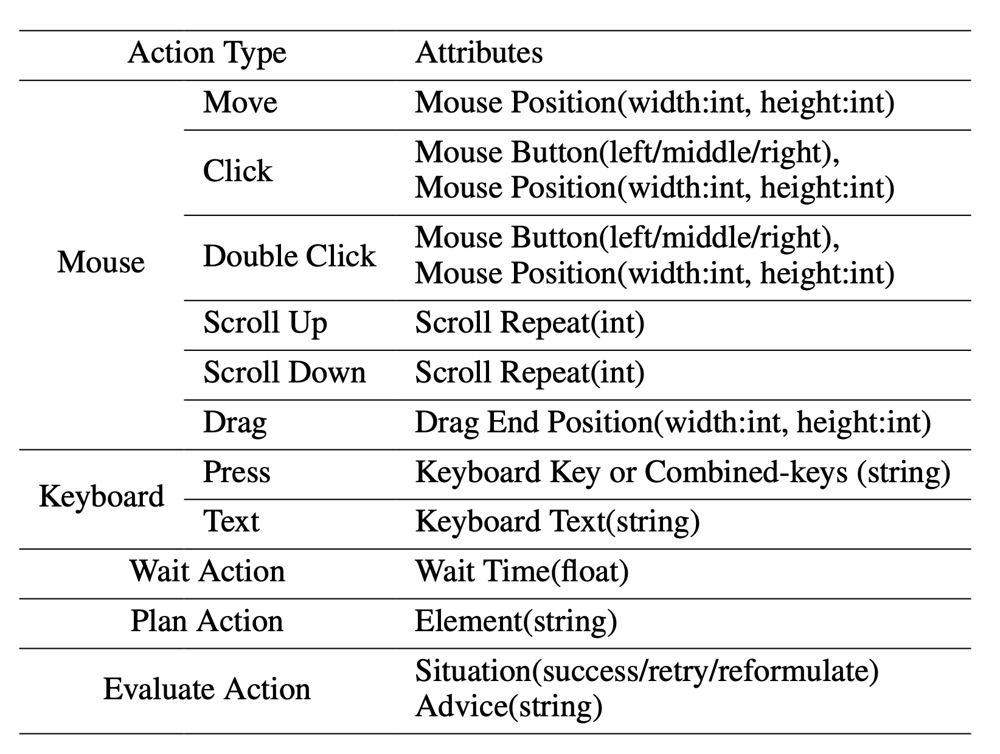
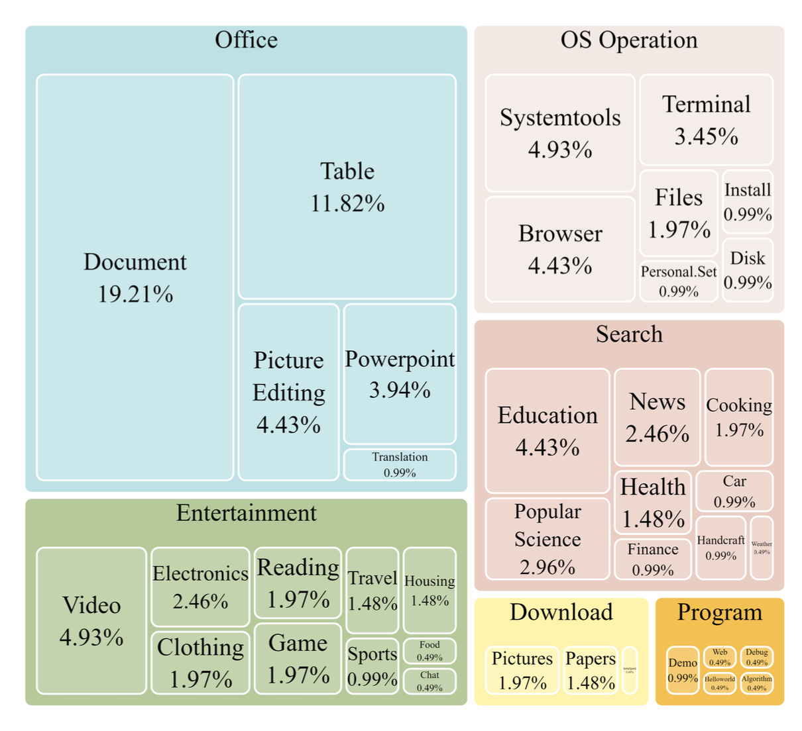
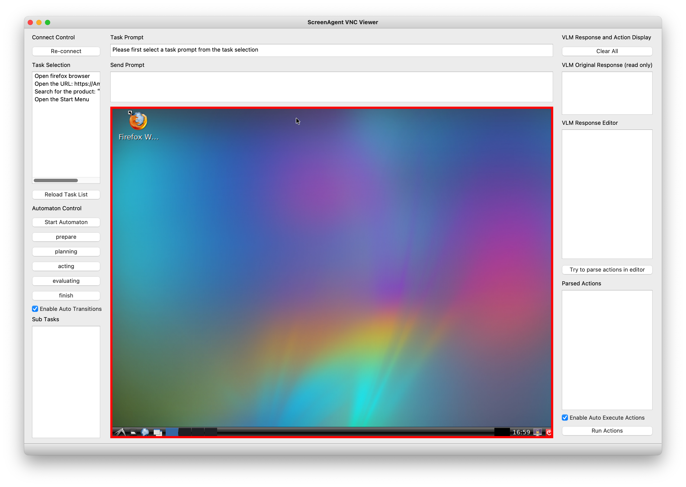
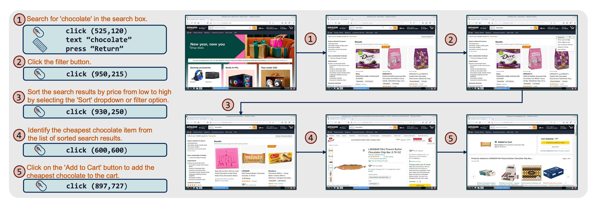

<p align="center">
<h1 align="center"> ScreenAgent  : A Computer Control Agent Driven by Visual Language Large Model</h1>
</p>

[View ScreenAgent Paper arxiv:2402.07945](https://arxiv.org/abs/2402.07945)

[中文版 Readme](README-zh.md)

## News
- (2024-4-17) The ScreenAgent paper has been accepted for presentation at IJCAI 2024! 
- (2024-5-19) [ScreenAgent Web Client](https://github.com/niuzaisheng/ScreenAgentWebClient) released, a simpler way to experience controlling a desktop with a large model.

## 
We have built the ScreenAgent project, creating an environment for Visual Language Model agents (VLM Agent) to interact with real computer screens. In this environment, the agent can observe screenshots and manipulate the GUI by outputting mouse and keyboard operations. We have also designed an automatic control process, which includes planning, action, and reflection stages, guiding the agent to continuously interact with the environment and complete multi-step tasks. In addition, we have built the ScreenAgent dataset, which collects screenshots and action sequences when completing various daily computer tasks.

<div align="center">
  
  <p><i>ScreenAgent Design Motivation</i></p>
</div>

To guide the VLM Agent to interact continuously with the computer screen, we have built a process that includes "planning-execution-reflection". In the planning phase, the Agent is asked to break down the user task into subtasks. In the execution phase, the Agent will observe the screenshot and give specific mouse and keyboard actions to execute the subtasks. The controller will execute these actions and feed back the execution results to the Agent. In the reflection phase, the Agent will observe the execution results, judge the current state, and choose to continue execution, retry, or adjust the plan. This process will continue until the task is completed.

<div align="center">
  
  <p><i>Running Process</i></p>
</div>

We referred to the VNC remote desktop connection protocol to design the action space of the Agent, which are all the most basic mouse and keyboard operations. Most of the mouse click operations require the Agent to give the exact screen coordinate position. Compared with calling specific APIs to complete tasks, this method is more universal and can be applied to various desktop operating systems and applications.

<div align="center">
  
  <p><i>Supported Action Types and Action Attributes</i></p>
</div>

Teaching the Agent to use a computer is not a simple matter. It requires the Agent to have multiple comprehensive abilities such as task planning, image understanding, visual positioning, and tool use. For this reason, we manually annotated the ScreenAgent dataset. This dataset covers a variety of daily computer tasks, including file operations, web browsing, gaming entertainment and other scenarios. We build a session according to the above "planning-execution-reflection" process.

<div align="center">
  
  <p><i>Dataset Task Type Distribution</i></p>
</div>

The project mainly includes the following parts:
```
ScreenAgent
├── client # Controller client code
│   ├── prompt # Prompt template
│   ├── config.yml # Controller client configuration file template
│   └── tasks.txt # Task list
├── data # Contains the ScreenAgent dataset and other vision positioning related datasets
├── model_workers # VLM inferencer
└── train # Model training code
```

# Preparation

## Step 1, Prepare the desktop to be controlled
First, you need to prepare the desktop operating system to be controlled, where the VNC Server is installed, such as [TightVNC](https://www.tightvnc.com/download.php). Or you can use a Docker container with a GUI. We have prepared a container `niuniushan/screenagent-env`. You can use the following command to pull and start this container:

```bash
docker run -d --name ScreenAgent -e RESOLUTION=1024x768 -p 5900:5900 -p 8001:8001 -e VNC_PASSWORD=<VNC_PASSWORD> -e CLIPBOARD_SERVER_SECRET_TOKEN=<CLIPBOARD_SERVER_SECRET_TOKEN> -v /dev/shm:/dev/shm niuniushan/screenagent-env:latest
```

Please replace `<VNC_PASSWORD>` with your new VNC password, and `<CLIPBOARD_SERVER_SECRET_TOKEN>` with your clipboard service password. Since keyboard input of long strings of text or unicode characters relies on the clipboard, if the clipboard service is not enabled, you can only input ASCII strings by pressing the keyboard in sequence, and you cannot input Chinese and other unicode characters. This image already contains a clipboard service, which listens to port 8001 by default. You need to set a password to protect your clipboard service. `niuniushan/screenagent-env` is built based on `fcwu/docker-ubuntu-vnc-desktop`. You can find more information about this image [here](https://github.com/fcwu/docker-ubuntu-vnc-desktop).

If you want to use an existing desktop environment, such as Windows, Linux Desktop, or any other desktop environment, you need to run any VNC Server and note its IP address and port number. If you want to enable the clipboard service, please perform the following steps in your desktop environment:

```bash
# Install dependencies
pip install fastapi pydantic uvicorn pyperclip 
# Set password in environment variable
export CLIPBOARD_SERVER_SECRET_TOKEN=<CLIPBOARD_SERVER_SECRET_TOKEN>
# Start clipboard service
python client/clipboard_server.py
```

`clipboard_server.py` will listen to port 8001 and receive the (text) instruction for keyboard input of long strings of text from the controller.

After keeping it running, you can test whether the clipboard service is working properly, for example:

```bash
curl --location 'http://localhost:8001/clipboard' \
--header 'Content-Type: application/json' \
--data '{
    "text":"Hello world",
    "token":"<CLIPBOARD_SERVER_SECRET_TOKEN>"
}'
```

If it works correctly, you will receive a response of `{"success": True, "message": "Text copied to clipboard"}`.
If you encounter an error "Pyperclip could not find a copy/paste mechanism for your system.", please add an environment variable specifying the X server location before running `python client/clipboard_server.py`:

```bash
export DISPLAY=:0.0
```

Please adjust according to your system environment. If you still encounter errors, please refer to [here](https://pyperclip.readthedocs.io/en/latest/introduction.html#not-implemented-error).

Please fill in the above information in the `remote_vnc_server` item of the configuration file `client/config.yml`.

## Step 2, Prepare the controller code running environment

You need to run the controller code, which has three missions: First, the controller will connect to the VNC Server, collect screenshots, and send commands such as mouse and keyboard; Second, the controller maintains a state machine internally, implementing an automatic control process of planning, action, and reflection, guiding the agent to continuously interact with the environment; Finally, the controller will construct complete prompts based on the prompt word template, send them to the large model inference API, and parse the control commands in the large model generated reply. The controller is a program based on PyQt5, you need to install some dependencies:

```bash
pip install -r client/requirements.txt
```

## Step 3, Prepare the large model inferencer or API

Please choose a VLM as the Agent, we provide inferencers for 4 models in `model_workers`, they are: GPT-4V, LLaVA-1.5, CogAgent, and ScreenAgent. You can also implement an inferencer yourself or use a third-party API, you can refer to the code in `client/interface_api` to implement a new API call interface.

Please refer to the `llm_api` part in `client/config.yml` to prepare the configuration file, only keep one model under `llm_api`.

```yaml
llm_api:

  # Select ONE of the following models to use:

  GPT4V:
    model_name: "gpt-4-vision-preview"
    openai_api_key: "<YOUR-OPENAI-API-KEY>"
    target_url: "https://api.openai.com/v1/chat/completions"

  LLaVA:
    model_name: "LLaVA-1.5"
    target_url: "http://localhost:40000/worker_generate"

  CogAgent:
    target_url: "http://localhost:40000/worker_generate"

  ScreenAgent:
    target_url: "http://localhost:40000/worker_generate"

  # Common settings for all models
  temperature: 1.0
  top_p: 0.9
  max_tokens: 500
  
```

### If you use GPT-4V as the Agent

Please set `llm_api` to `GPT4V` in `client/config.yml`, and fill in your OpenAI API Key, please always pay attention to your account balance.

### If you use LLaVA-1.5 as the Agent

Please refer to the [LLaVA](https://github.com/haotian-liu/LLaVA) project to download and prepare the LLaVA-1.5 model, for example:

```bash
git clone https://github.com/haotian-liu/LLaVA.git
cd LLaVA
conda create -n llava python=3.10 -y
conda activate llava
pip install --upgrade pip  # enable PEP 660 support
pip install -e .
```

`model_workers/llava_model_worker.py` provides a non-streaming output inferencer for LLaVA-1.5. You can copy it to `llava/serve/model_worker` and start it with the following command:

```bash
cd llava
python -m llava.serve.llava_model_worker --host 0.0.0.0 --port 40000 --worker http://localhost:40000 --model-path liuhaotian/llava-v1.5-13b --no-register
```

### If using CogAgent as the Agent

Please refer to the [CogVLM](https://github.com/THUDM/CogVLM) project to download and prepare the CogAgent model. Download the sat version of the CogAgent weights `cogagent-chat.zip` from [here](https://huggingface.co/THUDM/CogAgent/tree/main), unzip it and place it in the `train/saved_models/cogagent-chat` directory.
`train/cogagent_model_worker.py` provides a non-streaming output inferencer for CogAgent. You can start it with the following command:

```bash
cd train
RANK=0 WORLD_SIZE=1 LOCAL_RANK=0 python ./cogagent_model_worker.py --host 0.0.0.0  --port 40000 --from_pretrained "saved_models/cogagent-chat" --bf16 --max_length 2048
```

### If using ScreenAgent as the Agent

ScreenAgent is trained based on CogAgent. Download the sat format weight file `ScreenAgent-2312.zip` from [here](https://huggingface.co/niurl/ScreenAgent), unzip it and place it in `train/saved_models/ScreenAgent-2312`. You can start it with the following command:

```bash
cd train
RANK=0 WORLD_SIZE=1 LOCAL_RANK=0 python ./cogagent_model_worker.py --host 0.0.0.0  --port 40000 --from_pretrained "./saved_models/ScreenAgent-2312" --bf16 --max_length 2048
```

# Run
After the preparation is complete, you can run the controller:

```bash
cd client
python run_controller.py -c config.yml
```

The controller interface is as follows. You need to double-click to select a task from the left side first, then press the "Start Automation" button. The controller will automatically run according to the plan-action-reflection process. The controller will collect the current screen image, fill in the prompt word template, send the image and complete prompt words to the large model inferencer, parse the reply from the large model inferencer, send mouse and keyboard control commands to the VNC Server, and repeat the process.

<div align="center">
  
  <p><i>The controller interface</i></p>
</div>


If the screen is stuck, try pressing the "Re-connect" button. The controller will try to reconnect to the VNC Server.

# Dataset

All datasets and dataset processing code are in the `data` directory. We used three existing datasets: COCO2014, Rico & widget-caption, and Mind2Web.

## COCO Dataset
We used COCO 2014 validation images as the training dataset for visual positioning capabilities. You can download COCO 2014 train images from [here](https://cocodataset.org/#download). The annotation information we used here is refcoco, split by unc.

```
├── COCO
   ├── prompts # Prompt word templates for training the Agent's visual positioning capabilities
   ├── train2014 # COCO 2014 train
   └── annotations # COCO 2014 annotations
```

## Rico & widget-caption Dataset

Rico is a dataset that contains a large number of screenshots and widget information of Android applications. You can download the "1. UI Screenshots and View Hierarchies (6 GB)" part of the Rico dataset from [here](http://www.interactionmining.org/rico.html). The file name is `unique_uis.tar.gz`. Please put the unzipped `combined` folder in the `data/Rico` directory.
widget-caption is an annotation of widget information based on Rico. Please clone the `https://github.com/google-research-datasets/widget-caption` project under `data/Rico`.
The final directory structure is as follows:
```
├── Rico
   ├── prompts # Prompt word templates for training the Agent's visual positioning capabilities
   ├── combined # Rico dataset screenshots
   └── widget-caption
       ├── split
       │   ├── dev.txt
       │   ├── test.txt
       │   └── train.txt
       └── widget_captions.csv
```

## Mind2Web Dataset 

[Mind2Web](https://osu-nlp-group.github.io/Mind2Web/) is a real simulated web browsing dataset. You need to download the original dataset and process it. First, use the globus tool to download the original web screenshots from [here](https://app.globus.org/file-manager?origin_id=32e6b738-a0b0-47f8-b475-26bf1c5ebf19). The folder name is `raw_dump`, placed in the `data/Mind2Web/raw_dump` directory, and then use the following command to process the dataset:

```bash
cd data/Mind2Web
python convert_dataset.py
```

This code will download the processed form of the `osunlp/Mind2Web` dataset from huggingface datasets. Please ensure that the network is smooth. At the same time, this step will involve translating English instructions into Chinese instructions.

```bash
cd data/Mind2Web
python convert_dataset.py
```

This code will download the processed form of the `osunlp/Mind2Web` dataset from huggingface datasets. Please ensure that the network is smooth. This step will involve translating English instructions into Chinese instructions. You need to call your own translation API in `data/Mind2Web/translate.py`.
The directory structure is as follows:
```
├── Mind2Web
   ├── convert_dataset.py
   ├── translate.py
   ├── prompts # Prompt word templates for training the Agent's web browsing capabilities
   ├── raw_dump # Mind2Web raw_dump downloaded from globus
   └── processed_dataset # Created by convert_dataset.py
```

## ScreenAgent Dataset

ScreenAgent is the dataset annotated in this paper, divided into training and testing sets, the directory structure is as follows:

```
├── data
    ├── ScreenAgent
        ├── train
        │   ├── <session id>
        │   │   ├── images
        │   │   │   ├── <timestamp-1>.jpg
        │   │   │   └── ...
        │   │   ├── <timestamp-1>.json
        │   │   └── ...
        │   ├── ...
        └── test
```

The meaning of each field in the json file:
- session_id: Session ID
- task_prompt: Overall goal of the task
- task_prompt_en: Overall goal of the task (En)
- task_prompt_zh: Overall goal of the task (Zh)
- send_prompt: Complete prompt sent to the model
- send_prompt_en: Complete prompt sent to the model (En)
- send_prompt_zh: Complete prompt sent to the model (Zh)
- LLM_response: Original reply text given by the model, i.e., reject response in RLHF
- LLM_response_editer: Reply text after manual correction, i.e., choice response in RLHF
- LLM_response_editer_en: Reply text after manual correction (En)
- LLM_response_editer_zh: Reply text after manual correction (Zh)
- video_height, video_width: Height and width of the image
- saved_image_name: Screenshot filename, under each session's images folder
- actions: Action sequence parsed from LLM_response_editer

<div align="center">
  
  <p><i>An Example in ScreenAgent Dataset</i></p>
</div>

# Train ScreenAgent
If you want to train your own model, or reproduce the ScreenAgent model, please prepare the above datasets first, and check all dataset paths in the `train/dataset/mixture_dataset.py` file. If you only want to use part of the datasets or add new datasets, please modify the `make_supervised_data_module` function in `train/dataset/mixture_dataset.py`. Please download the sat version of the CogAgent weights `cogagent-chat.zip` from [here](https://huggingface.co/THUDM/CogAgent/tree/main), unzip it and place it in the `train/saved_models/` directory.

You need to pay attention to and check the following files:
```
train
├── data -> ../data
├── dataset
│   └── mixture_dataset.py
├── finetune_ScreenAgent.sh
└── saved_models
    └── cogagent-chat # unzip cogagent-chat.zip
        ├── 1
        │   └── mp_rank_00_model_states.pt
        ├── latest
        └── model_config.json
```

Please modify the parameters in `train/finetune_ScreenAgent.sh` according to your device situation, then run:
```bash
cd train
bash finetune_ScreenAgent.sh
```

Finally, if you want to merge the weights of sat distributed training into a single weight file, please refer to the `train/merge_model.sh` code. Make sure that the number of model parallelism `MP_SIZE` in this file is consistent with `WORLD_SIZE` in `train/finetune_ScreenAgent.sh`. Modify the parameter after `--from-pretrained` to the checkpoint location stored during training. The merged weight file will be saved as the `train/saved_models/merged_model` folder.

# TODO
- [ ] Provide huggingface transformers weights.
- [ ] Simplify the design of the controller, provide a no render mode.
- [ ] Integrate Gym.
- [ ] Add skill libraries to support more complex function calls.

# Related Projects
- Mobile-Agent: Autonomous Multi-Modal Mobile Device Agent with Visual Perception http://arxiv.org/abs/2401.16158
- UFO: A UI-Focused Agent for Windows OS Interaction http://arxiv.org/abs/2402.07939
- ScreenAI: A Vision-Language Model for UI and Infographics Understanding http://arxiv.org/abs/2402.04615
- AppAgent: Multimodal Agents as Smartphone Users http://arxiv.org/abs/2312.13771
- CogAgent: A Visual Language Model for GUI Agents http://arxiv.org/abs/2312.08914
- Screen2Words: Automatic Mobile UI Summarization with Multimodal Learning http://arxiv.org/abs/2108.03353
- A Real-World WebAgent with Planning, Long Context Understanding, and Program Synthesis http://arxiv.org/abs/2307.12856
- Comprehensive Cognitive LLM Agent for Smartphone GUI Automation http://arxiv.org/abs/2402.11941
- Towards General Computer Control: A Multimodal Agent for Red Dead Redemption II as a Case Study https://arxiv.org/abs/2403.03186
- Scaling Instructable Agents Across Many Simulated Worlds [link to technical report](https://storage.googleapis.com/deepmind-media/DeepMind.com/Blog/sima-generalist-ai-agent-for-3d-virtual-environments/Scaling%20Instructable%20Agents%20Across%20Many%20Simulated%20Worlds.pdf)
- Android in the Zoo: Chain-of-Action-Thought for GUI Agents http://arxiv.org/abs/2403.02713
- OmniACT: A Dataset and Benchmark for Enabling Multimodal Generalist Autonomous Agents for Desktop and Web http://arxiv.org/abs/2402.17553
- Comprehensive Cognitive LLM Agent for Smartphone GUI Automation http://arxiv.org/abs/2402.11941
- Improving Language Understanding from Screenshots http://arxiv.org/abs/2402.14073
- AndroidEnv: A Reinforcement Learning Platform for Android http://arxiv.org/abs/2105.13231
- SeeClick: Harnessing GUI Grounding for Advanced Visual GUI Agents https://arxiv.org/abs/2401.10935
- AgentStudio: A Toolkit for Building General Virtual Agents https://arxiv.org/abs/2403.17918
- ReALM: Reference Resolution As Language Modeling https://arxiv.org/abs/2403.20329
- AutoWebGLM: Bootstrap And Reinforce A Large Language Model-based Web Navigating Agent https://arxiv.org/abs/2404.03648
- Octopus v2: On-device language model for super agent https://arxiv.org/pdf/2404.01744.pdf
- Mobile-Env: An Evaluation Platform and Benchmark for LLM-GUI Interaction https://arxiv.org/abs/2305.08144
- OSWorld: Benchmarking Multimodal Agents for Open-Ended Tasks in Real Computer Environments https://arxiv.org/abs/2404.07972
- Ferret-UI: Grounded Mobile UI Understanding with Multimodal LLMs https://arxiv.org/abs/2404.05719
- VisualWebBench: How Far Have Multimodal LLMs Evolved in Web Page Understanding and Grounding? https://arxiv.org/abs/2404.05955
- OS-Copilot: Towards Generalist Computer Agents with Self-Improvement https://arxiv.org/abs/2402.07456
- VisualWebBench: How Far Have Multimodal LLMs Evolved in Web Page Understanding and Grounding? https://arxiv.org/abs/2404.05955
- OS-Copilot: Towards Generalist Computer Agents with Self-Improvement https://arxiv.org/abs/2402.07456
- AutoDroid: LLM-powered Task Automation in Android https://arxiv.org/abs/2308.15272
- Fine-Tuning Large Vision-Language Models as Decision-Making Agents via Reinforcement Learning https://rl4vlm.github.io
- WebArena: A Realistic Web Environment for Building Autonomous Agents https://arxiv.org/abs/2307.13854
- Synapse: Trajectory-as-Exemplar Prompting with Memory for Computer Control https://openreview.net/pdf?id=Pc8AU1aF5e

# Citation

```bib
@article{niu2024screenagent,
      title={ScreenAgent: A Vision Language Model-driven Computer Control Agent}, 
      author={Runliang Niu and Jindong Li and Shiqi Wang and Yali Fu and Xiyu Hu and Xueyuan Leng and He Kong and Yi Chang and Qi Wang},
      year={2024},
      eprint={2402.07945},
      archivePrefix={arXiv},
      primaryClass={cs.HC}
}
```

# License
```
Code License: MIT
Dataset License: Apache-2.0
Model License: The CogVLM License
```
